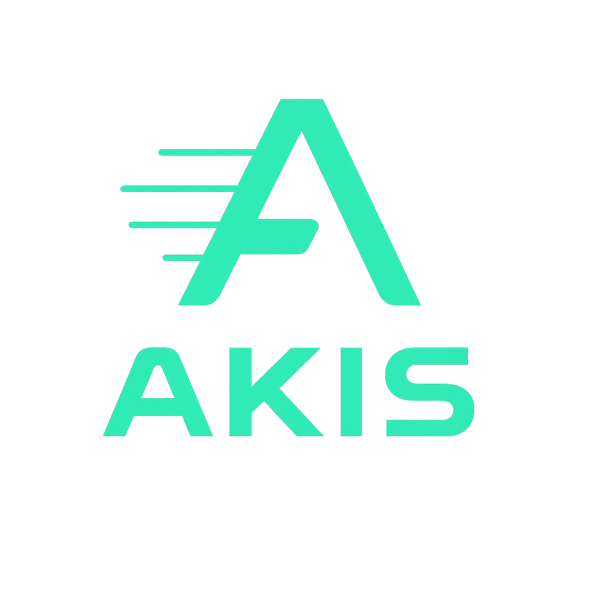

<p align="center">
  
</p>

<h1 align="center">AKIS Platform</h1>

<p align="center">
  <strong>Adaptive Knowledge Integrity System</strong><br/>
  Yapay Zeka Destekli Çok Ajanlı Yazılım Geliştirme Platformu
</p>

<p align="center">
  
  
  
  
  
  
</p>

---

## Nedir?

AKIS, doğal dilde anlatılan bir yazılım fikrini üç özelleştirilmiş yapay zeka ajanı aracılığıyla **çalışır durumda bir projeye** dönüştüren açık kaynaklı bir platformdur. Her aşamada bilgi bütünlüğü (Knowledge Integrity) doğrulama mekanizmaları ile çıktı kalitesi garanti altına alınır.

```
Kullanıcı Fikri → [Scribe] → Spec → [İnsan Onayı] → [Proto] → Kod → [Trace] → Testler → ✓ Proje
```

---

## Mimari

AKIS, **modüler monolit** mimari üzerine kurulmuş bir yapay zeka ajan orkestrasyon sistemidir. Sistem üç ana katmandan oluşur: kullanıcı arayüzü, iş mantığı ve altyapı servisleri. Tüm ajan iletişimi merkezi `PipelineOrchestrator` üzerinden yönetilir — ajanlar birbirini doğrudan çağırmaz.

### Sistem Katmanları

```
┌─────────────────────────────────────────────────────────────────────────────┐
│                         SUNUM KATMANI                                      │
│                                                                             │
│  React 19 SPA (Vite 7 + Tailwind CSS 4 + React Router 7)                  │
│                                                                             │
│  ┌────────────┐ ┌──────────────┐ ┌─────────────┐ ┌──────────────────────┐  │
│  │  Dashboard  │ │ Workflow Chat│ │ Kod Görüntü │ │ StackBlitz Önizleme  │  │
│  │  & Ajanlar  │ │ & Spec Onay  │ │   leyici    │ │ (WebContainer SDK)   │  │
│  └──────┬─────┘ └──────┬───────┘ └──────┬──────┘ └──────────┬───────────┘  │
│         │              │                │                    │              │
│         └──────────────┴────────────────┴────────────────────┘              │
│                        │ REST + SSE (EventSource)                           │
├────────────────────────┼────────────────────────────────────────────────────┤
│                        ▼                                                    │
│                    İŞ MANTIĞI KATMANI                                       │
│                                                                             │
│  Fastify 4 Plugin Mimarisi + TypeScript                                    │
│                                                                             │
│  ┌─────────────────────────────────────────────────────────────────────┐    │
│  │                     REST API Katmanı                                │    │
│  │  /api/pipelines/* · /auth/* · /api/github/* · /health              │    │
│  └──────────────────────────────┬──────────────────────────────────────┘    │
│                                 │                                           │
│  ┌──────────────┐  ┌────────────┴────────────┐  ┌───────────────────────┐  │
│  │ Auth Service  │  │  Pipeline Orchestrator   │  │   GitHub Service     │  │
│  │              │  │                           │  │                       │  │
│  │ JWT Session  │  │  Sonlu Durum Makinesi     │  │  REST API Adapter    │  │
│  │ OAuth Flow   │  │  Ajan Yaşam Döngüsü      │  │  Repo/Branch/PR/     │  │
│  │ (GitHub,     │  │  SSE Event Yayını         │  │  Commit İşlemleri    │  │
│  │  Google)     │  │  Hata Yönetimi + Retry    │  │                       │  │
│  └──────────────┘  └──┬────────┬────────┬─────┘  └───────────────────────┘  │
│                       │        │        │                                    │
│                 ┌─────┴──┐ ┌──┴─────┐ ┌┴──────┐                            │
│                 │ SCRIBE │ │ PROTO  │ │ TRACE │                             │
│                 │        │ │        │ │       │                              │
│                 │ Fikir→ │ │ Spec→  │ │ Kod→  │                             │
│                 │ Spec   │ │ Kod    │ │ Test  │                              │
│                 └────────┘ └────────┘ └───────┘                             │
│                                                                             │
├─────────────────────────────────────────────────────────────────────────────┤
│                      ALTYAPI KATMANI                                        │
│                                                                             │
│  ┌──────────────────┐  ┌────────────────┐  ┌────────────────────────────┐  │
│  │  PostgreSQL 16    │  │ Claude API     │  │  GitHub REST API           │  │
│  │  (Drizzle ORM)    │  │ (Sonnet 4.6)   │  │  (OAuth + PAT)            │  │
│  │                    │  │                │  │                            │  │
│  │  users, pipelines  │  │ temperature=0  │  │  Repo oluşturma           │  │
│  │  ai_usage          │  │ JSON çıktı     │  │  Branch, commit, push     │  │
│  │                    │  │ Güven skoru    │  │  Pull Request              │  │
│  └──────────────────┘  └────────────────┘  └────────────────────────────┘  │
└─────────────────────────────────────────────────────────────────────────────┘
```

### Pipeline Akışı

```
                    ┌──────────────────┐
                    │   Kullanıcı      │
                    │   "Kişisel finans│
                    │    uygulaması"   │
                    └────────┬─────────┘
                             │
                             ▼
              ┌──────────────────────────────┐
              │         1. SCRIBE            │
              │                              │
              │  Clarification (3-5 soru)    │
              │         ▼                    │
              │  Spec Üretimi                │
              │  • Problem Tanımı            │
              │  • Kullanıcı Hikayeleri      │
              │  • Kabul Kriterleri          │
              │  • Güven Skoru: %88-95       │
              └──────────────┬───────────────┘
                             │
                             ▼
              ┌──────────────────────────────┐
              │      2. İNSAN KAPISI         │
              │                              │
              │  Kullanıcı spec'i inceler    │
              │  ┌────────┐  ┌────────────┐  │
              │  │ Onayla  │  │  Reddet +  │  │
              │  │   ✓     │  │ Düzenle    │  │
              │  └────┬───┘  └──────┬─────┘  │
              └───────┼─────────────┼────────┘
                      │             │ ↺ Scribe'a geri
                      ▼
              ┌──────────────────────────────┐
              │         3. PROTO             │
              │                              │
              │  Dosya yapısı planla          │
              │  Kaynak kod üret (AI)        │
              │  GitHub branch aç            │
              │  Dosyaları commit + push     │
              │  Pull Request oluştur        │
              │  Bütünlük doğrulaması        │
              └──────────────┬───────────────┘
                             │
                             ▼
              ┌──────────────────────────────┐
              │         4. TRACE             │
              │                              │
              │  GitHub'dan gerçek kodu oku   │
              │  Route/endpoint analizi      │
              │  AC başına Playwright testi   │
              │  İzlenebilirlik matrisi      │
              │  (AC ↔ Test eşlemesi)        │
              └──────────────┬───────────────┘
                             │
                             ▼
              ┌──────────────────────────────┐
              │        ✓ TAMAMLANDI          │
              │                              │
              │  Çalışır proje + testler     │
              │  GitHub PR + canlı önizleme  │
              └──────────────────────────────┘
```

### Durum Makinesi (FSM)

Pipeline deterministik bir sonlu durum makinesi olarak çalışır:

```
scribe_clarifying ──→ scribe_generating ──→ awaiting_approval
                                                   │
                                     ┌─────────────┤
                                     │ Onayla       │ Reddet
                                     ▼              ▼
                              proto_building    (düzenle → yeniden onayla)
                                     │
                                     ▼
                              trace_testing
                                     │
                              ┌──────┴──────┐
                              ▼              ▼
                          completed    completed_partial

Her aşamadan → failed (max 3 retry, backoff: 5s / 15s / 30s) | cancelled
Aşama timeout'ları: Scribe 5dk, Proto 5dk, Trace 10dk
```

### Ajan Arası Sözleşme

Ajanlar arasındaki veri akışı tiplenmiş TypeScript arayüzleri ile tanımlanır:

```typescript
// Scribe çıktısı → İnsan onayı → Proto girdisi
ScribeOutput {
  spec: StructuredSpec       // Problem, User Stories, AC, Tech Constraints
  confidence: number         // 0-100 güven skoru
  clarificationsAsked: number
  rawMarkdown: string
}

// Proto çıktısı → Trace girdisi
ProtoOutput {
  branch: string             // proto/scaffold-{timestamp}
  repo: string               // hedef repo adı
  files: FileInfo[]           // üretilen dosya listesi
  prUrl: string              // GitHub PR bağlantısı
  verificationReport: Report // bütünlük kontrolü sonucu
}

// Trace çıktısı → Sonuç
TraceOutput {
  testFiles: TestFile[]              // Playwright test dosyaları
  coverageMatrix: CoverageMatrix     // AC ↔ Test eşleme matrisi
  traceability: Traceability[]       // izlenebilirlik kaydı
}
```

### Doğrulama Zinciri (Knowledge Integrity)

AKIS'in temel tasarım ilkesi: yapay zeka çıktısı her katmanda bağımsız bir doğrulayıcı tarafından kontrol edilir.

```
 Scribe üretir ──→  İNSAN doğrular   (spec onayı / reddi)
                         │
 Proto üretir  ──→  TRACE doğrular   (kodu okuyup test yazar)
                         │
 Trace üretir  ──→  OTOMATİK doğrular (testler çalıştırılır)
```

| Aşama | Üretici | Doğrulayıcı | Yöntem |
|-------|---------|-------------|--------|
| Spec | Scribe | **İnsan** | UI'da incele, onayla veya reddet |
| Kod | Proto | **Trace** | GitHub'dan gerçek kodu oku, test yaz |
| Test | Trace | **Otomatik** | Playwright testlerini çalıştır |

---

## Teknoloji Yığını

| Katman | Teknoloji | Detay |
|--------|-----------|-------|
| **Frontend** | React 19, Vite 7, Tailwind CSS 4 | SPA, SSE ile gerçek zamanlı akış, StackBlitz canlı önizleme |
| **Backend** | Fastify 4, TypeScript | Plugin mimarisi, provider-agnostic AI servisi |
| **Veritabanı** | PostgreSQL 16, Drizzle ORM | Tip güvenli şema, migration desteği |
| **AI** | Anthropic Claude API (Sonnet 4.6) | temperature=0, JSON çıktı, güven skorlaması |
| **Entegrasyon** | GitHub REST API | Repo oluşturma, branch, commit, PR — OAuth ile kimlik doğrulama |
| **Test** | Vitest, Playwright | Birim testler + AI tarafından üretilen E2E testler |
| **Altyapı** | Docker, Caddy | SSE desteği, container tabanlı dağıtım |

---

## Özellikler

- **Sıralı Çok Ajan Pipeline** — Scribe → İnsan Kapısı → Proto → Trace
- **Gerçek Zamanlı İzleme** — SSE ile canlı ajan aktivite akışı
- **Canlı Önizleme** — StackBlitz WebContainer ile tarayıcıda çalışan uygulama
- **Kod Görüntüleyici** — Syntax highlighted dosya inceleme
- **GitHub Entegrasyonu** — Otomatik repo, branch, commit, PR
- **Dev Modu** — Pipeline sonrası chat tabanlı iteratif geliştirme (DevAgent)
- **Ajan Metrikleri** — Performans, güven skoru, başarı oranı takibi
- **OAuth** — GitHub ve Google ile oturum açma
- **Türkçe Arayüz** — Tamamen Türkçeleştirilmiş kullanıcı deneyimi

---

## Proje Yapısı

```
├── backend/                    Fastify 4 + TypeScript
│   └── src/
│       ├── pipeline/           Pipeline motoru
│       │   ├── agents/         Scribe, Proto, Trace ajanları
│       │   │   ├── scribe/     ScribeAgent.ts, prompts/, schemas/
│       │   │   ├── proto/      ProtoAgent.ts, prompts/
│       │   │   └── trace/      TraceAgent.ts, prompts/
│       │   ├── core/           PipelineOrchestrator, FSM, contracts
│       │   ├── adapters/       GitHubRESTAdapter
│       │   └── api/            pipeline.routes.ts
│       ├── api/                REST API (auth, github, health)
│       ├── db/                 Drizzle ORM şema + migration
│       └── services/           AI, auth, email servisleri
├── frontend/                   React 19 + Vite 7 SPA
│   └── src/
│       ├── pages/dashboard/    Overview, Workflows, Agents, Settings
│       ├── components/         Chat, Preview, StatusBadge, Pipeline
│       └── services/api/       HTTP client'lar
├── docs/                       Mimari ve API dokümantasyonu
└── scripts/                    Veritabanı ve yardımcı betikler
```

---

## Kurulum

### Gereksinimler

- Node.js 20+ ve pnpm 9+
- Docker & Docker Compose
- Anthropic API anahtarı
- GitHub OAuth uygulaması (opsiyonel)

### Hızlı Başlangıç

```bash
git clone https://github.com/OmerYasirOnal/akis-platform.git
cd akis-platform

# Veritabanını başlat
./scripts/db-up.sh

# Backend
cd backend
cp .env.example .env       # API anahtarlarını düzenle
pnpm install && pnpm dev   # → http://localhost:3000

# Frontend (ayrı terminal)
cd frontend
pnpm install && pnpm dev   # → http://localhost:5173
```

Tarayıcıda `http://localhost:5173/dashboard` adresine git.

Ortam değişkenleri hakkında detaylı bilgi: [`docs/ENV_SETUP.md`](docs/ENV_SETUP.md)

---

## Katkıda Bulunma

Katkıda bulunmak için [`CONTRIBUTING.md`](CONTRIBUTING.md) dosyasını oku.

## Lisans

MIT — detaylar için [`LICENSE`](LICENSE) dosyasına bak.
