<p align="center">
  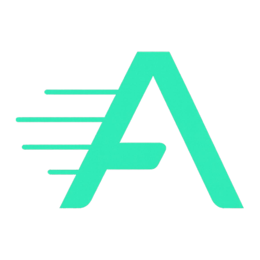
</p>

<h1 align="center">AKIS Platform</h1>

<p align="center">
  <strong>Adaptive Knowledge Integrity System</strong><br/>
  <sub>AI destekli agent orkestrasyon motoru — fikirleri dogrulanmis yazilima donusturur.</sub>
</p>

<p align="center">
  <a href="https://akisflow.com"></a>
</p>

<p align="center">
  &nbsp;
  &nbsp;
  
</p>

<p align="center">
  
  
  
  
  
  
</p>

<br/>

<p align="center">
  <a href="#turkce"><kbd>&nbsp;&nbsp;Turkce&nbsp;&nbsp;</kbd></a>&nbsp;&nbsp;
  <a href="#english"><kbd>&nbsp;&nbsp;English&nbsp;&nbsp;</kbd></a>
</p>

<br/>

---

## Turkce

<details open>
<summary><b>Icerik</b></summary>

- [Genel Bakis](#genel-bakis) · [Ekran Goruntuleri](#ekran-goruntuleri) · [Ozellikler](#ozellikler)
- [Mimari](#mimari) · [Teknoloji Yigini](#teknoloji-yigini) · [Proje Yapisi](#proje-yapisi)
- [Nasil Kullanilir](#nasil-kullanilir) · [Gelistirme Ortami](#gelistirme-ortami)
- [Katki Rehberi](#katki-rehberi) · [API Referansi](#api-referansi)
- [Guvenlik](#guvenlik) · [Dagitim](#dagitim) · [Akademik Baglam](#akademik-baglam)

</details>

### Genel Bakis

AKIS, yazilim gelistirme surecini uc uzmanlasmis AI agent ile otomatize eden bir pipeline motorudur. Fikrinizi dogal dilde anlatirsiniz; AKIS yapilandirilmis bir spec dokumani uretir, calisan bir kod tabani olusturur ve dogrulama testleri yazar — hepsi insan onay kapisiyla.

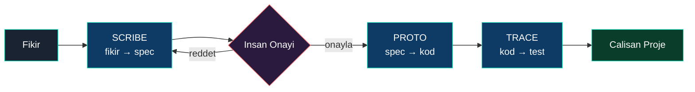

Her agent'in ciktisi bir sonraki asamada dogrulanir. Bu **dogrulama zinciri** platformun temel tasarim prensibidir — Scribe spec'leri insan tarafindan onaylanir, Proto kodu Trace tarafindan test edilir, Trace testleri otomatik calisir.

---

### Ekran Goruntuleri

<table>
  <tr>
    <td width="50%">
      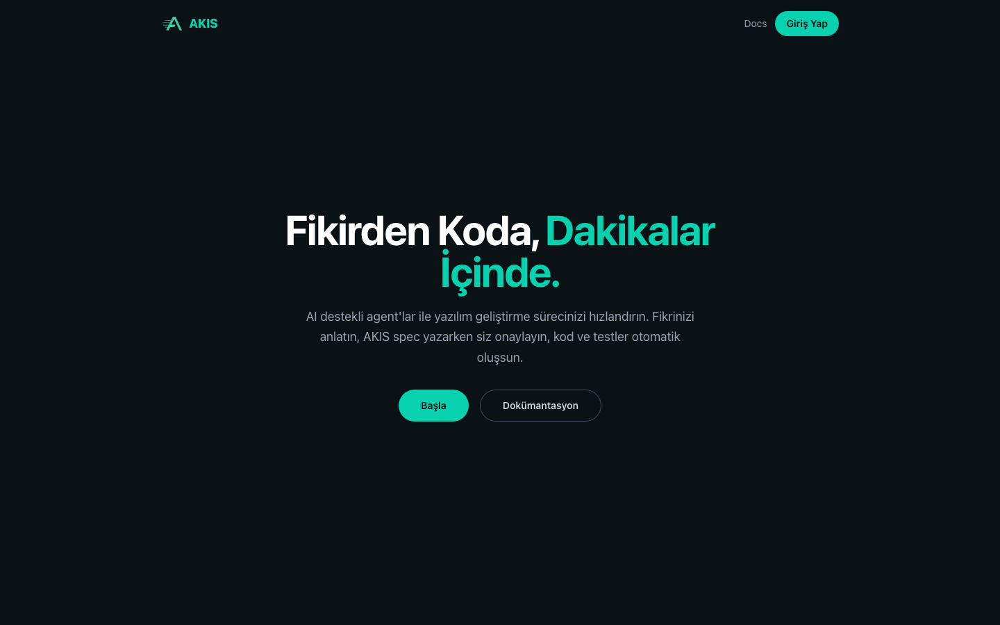<br/>
      <sub><b>Giris Sayfasi</b> — Frosted-glass temasinda hero bolumu</sub>
    </td>
    <td width="50%">
      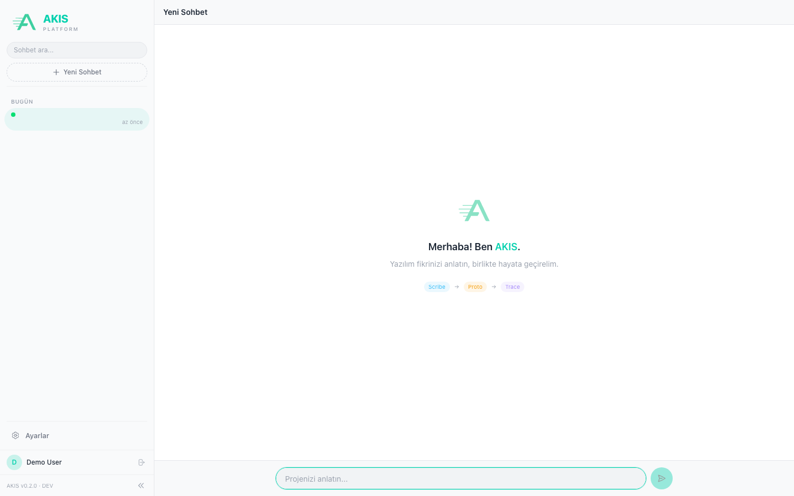<br/>
      <sub><b>Sohbet Arayuzu</b> — Sidebar, agent pipeline, mesaj girisi</sub>
    </td>
  </tr>
  <tr>
    <td width="50%">
      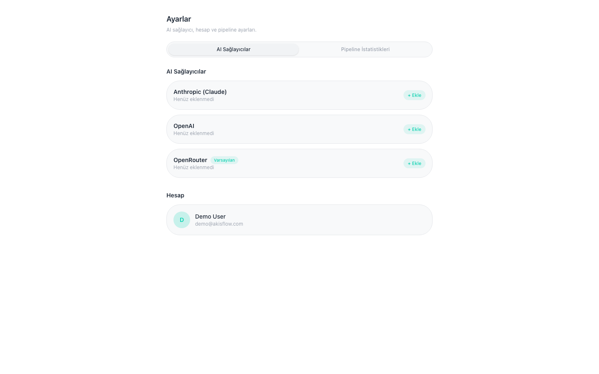<br/>
      <sub><b>Ayarlar</b> — AI saglayici yonetimi ve profil</sub>
    </td>
    <td width="50%">
      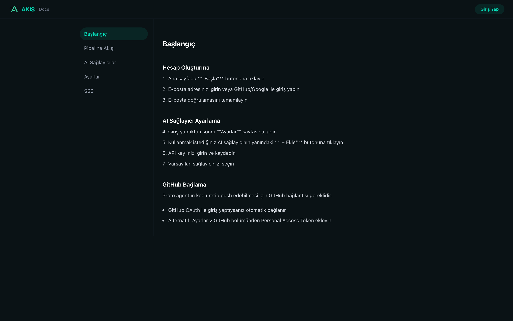<br/>
      <sub><b>Dokumantasyon</b> — Baslangic, AI kurulumu, GitHub entegrasyonu</sub>
    </td>
  </tr>
</table>

---

### Ozellikler

<table>
<tr>
<td width="50%" valign="top">

**Sirasal Agent Pipeline**<br/>
<sub>Scribe (spec) → Insan Kapisi → Proto (kod) → Trace (test)</sub>

</td>
<td width="50%" valign="top">

**Gercek Zamanli Akis**<br/>
<sub>SSE tabanli canli agent aktivitesi izleme</sub>

</td>
</tr>
<tr>
<td width="50%" valign="top">

**MCP ile GitHub Entegrasyonu**<br/>
<sub>Model Context Protocol: repo, branch, commit, PR</sub>

</td>
<td width="50%" valign="top">

**Coklu AI Saglayici**<br/>
<sub>Anthropic Claude, OpenAI, OpenRouter — kullanici ayarli</sub>

</td>
</tr>
<tr>
<td width="50%" valign="top">

**OAuth Kimlik Dogrulama**<br/>
<sub>GitHub + Google ile giris, e-posta/sifre destegi</sub>

</td>
<td width="50%" valign="top">

**Pipeline Istatistikleri**<br/>
<sub>Basari orani, agent sureleri, calistirma gecmisi</sub>

</td>
</tr>
<tr>
<td width="50%" valign="top">

**Onboarding Akisi**<br/>
<sub>Animasyonlu karsilama sihirbazi ve profil kurulumu</sub>

</td>
<td width="50%" valign="top">

**Tam Lokalizasyon**<br/>
<sub>Turkce ve Ingilizce arayuz destegi (i18n)</sub>

</td>
</tr>
</table>

---

### Mimari

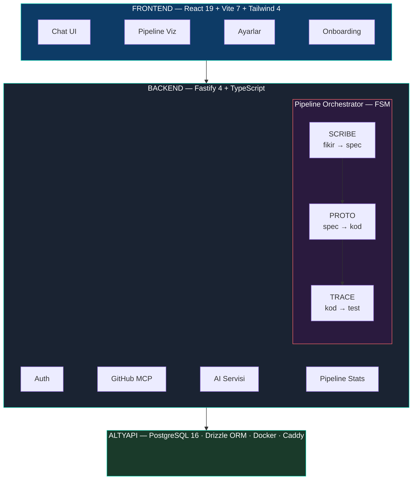

#### Agent'lar

| Agent | Rol | Girdi | Cikti |
|-------|-----|-------|-------|
| **Scribe** | Is analisti — fikri yapilandirir | Serbest metin fikir | Yapilandirilmis spec (markdown) |
| **Proto** | Gelistirici — calisan kod uretir | Onaylanmis spec | GitHub'a push edilen MVP scaffold |
| **Trace** | Dogrulayici — kod icin test yazar | GitHub branch + kod | Playwright test paketi |

#### Dogrulama Zinciri

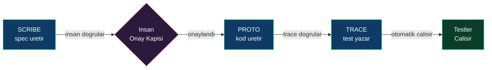

#### MCP Entegrasyonu

AKIS, GitHub ile etkilesim icin **Model Context Protocol (MCP)** kullanir. Pipeline'daki `GitHubMCPAdapter`, agent'larin (Proto ve Trace) repo olusturma, branch push'lama, PR acma gibi islemleri standart bir arac-cagirma arayuzu uzerinden yapmasini saglar. MCP kullanilamadiginda `GitHubRESTAdapter` yedek olarak devreye girer.

#### Pipeline Durum Makinesi

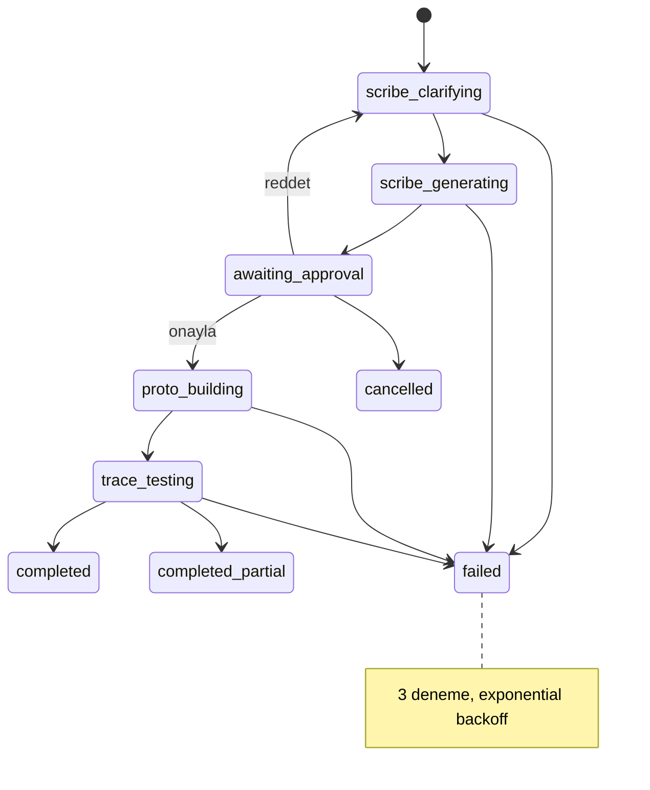

---

### Teknoloji Yigini

<p align="center">
  
  
  
  
</p>
<p align="center">
  
  
  
  
</p>
<p align="center">
  
  
  
  
</p>

---

### Proje Yapisi

<details>
<summary><b>Klasor agacini goster</b></summary>

```
devagents/
├── backend/                    Fastify 4 + TypeScript
│   └── src/
│       ├── pipeline/           Pipeline motoru
│       │   ├── agents/         scribe/, proto/, trace/
│       │   ├── core/           PipelineOrchestrator, FSM, contracts
│       │   ├── adapters/       GitHubRESTAdapter, GitHubMCPAdapter
│       │   └── api/            pipeline.routes.ts
│       ├── api/                REST API route'lari (auth, github, settings)
│       ├── db/                 Drizzle ORM sema + migration'lar
│       └── services/           AI, auth, email servisleri
├── frontend/                   React 19 + Vite 7 SPA
│   └── src/
│       ├── pages/              chat/, settings/, auth/, docs
│       ├── components/         chat/, onboarding/, ui/, pipeline/
│       ├── hooks/              usePipelineStream, useProfileCompleteness
│       └── services/api/       HTTP client, workflow, auth
├── deploy/                     Docker Compose, Caddy, deploy script'leri
└── docs/                       Mimari dokumanlari ve ekran goruntuleri
```

</details>

---

### Nasil Kullanilir

AKIS'i kullanmaya baslamak icin asagidaki adimlari izleyin. Canli surum: **[akisflow.com](https://akisflow.com)**

#### 1. Hesap Olusturma

- **E-posta/Sifre:** Kayit sayfasinda (`/signup`) adinizi, e-posta adresinizi ve sifrenizi girin.
- **OAuth:** "GitHub ile Giris" veya "Google ile Giris" butonlarina tiklayarak hizlica hesap olusturun.
- Giris yaptiktan sonra karsilama sihirbazi sizi yonlendirecektir.

#### 2. AI API Key Ekleme

Pipeline'in calisabilmesi icin bir AI saglayicisi API key'i gereklidir.

1. **Ayarlar** sayfasina gidin (`/settings`).
2. **AI Saglayici** sekmesinde "Yeni Key Ekle" butonuna tiklayin.
3. Saglayicinizi secin: **Anthropic** (onerilen), **OpenAI** veya **OpenRouter**.
4. API key'inizi yapishtirin ve kaydedin.

> [!IMPORTANT]
> Key olmadan pipeline baslatilamaz. Platform key'iniz yoksa mock modunda calisir. Key'ler AES-256-GCM ile sifrelenerek saklanir.

#### 3. GitHub Baglama

Proto agent'in kod push'layabilmesi ve Trace'in kodu okuyabilmesi icin GitHub baglantisi gerekir.

1. **Ayarlar > GitHub** bolumune gidin.
2. GitHub **Personal Access Token (PAT)** olusturun: `repo` ve `workflow` yetkilerini verin.
3. Token'i yapishtirip "Baglan" butonuna tiklayin.
4. Baglanti durumunu kontrol edin — yesil badge "Bagli" gostermelidir.

#### 4. Pipeline Baslatma

1. **Chat** sayfasina gidin (`/chat`).
2. Mesaj alanina fikrinizi yazin, ornegin: *"Kullanicilarin yemek tarifleri paylasabilecegi bir web uygulamasi"*
3. Gonderin — **Scribe** agent'i calismaya baslar.

#### 5. Scribe ile Etkilesim

Scribe fikrinizi analiz eder ve gerektiginde sorular sorar:
- Sorulari chat arayuzunde goreceksiniz.
- Yanitlarinizi yazip gonderin — Scribe bunlari dikkate alarak spec'i olusturur.
- Scribe yeterli bilgiye sahip oldugunda yapilandirilmis spec dokumani uretir.

#### 6. Spec Onaylama / Reddetme

Scribe spec'i olusturdugunda:
- **Onayla:** Spec'in dogrulugunu inceleyin, uygunsa "Onayla" butonuna tiklayin. Proto baslatilir.
- **Reddet:** Duzeltilmesi gereken noktalar varsa "Reddet"e tiklayin ve geri bildiriminizi yazin. Scribe yeniden calisir.

#### 7. Proto'nun Kod Uretmesini Izleme

Spec onaylandiktan sonra Proto calismaya baslar:
- Chat'te gercek zamanli ilerleme goruntusu gorursunuz (SSE stream).
- Proto, onaylanan spec'e gore MVP scaffold uretir.
- Tamamlandiginda kodlar GitHub'a push edilir (branch: `proto/scaffold-{timestamp}`).

#### 8. Trace Test Sonuclarini Goruntuleme

Proto tamamlandiktan sonra Trace otomatik baslar:
- Trace, Proto'nun push ettigi branch'teki **gercek kodu** GitHub'dan okur.
- Bu koda ozel Playwright otomasyon testleri yazar.
- Pipeline tamamlandiginda durum `completed` veya `completed_partial` olur.

> [!TIP]
> Herhangi bir asamada hata olusursa "Tekrar Dene" butonu ile o asamayi yeniden baslatabilirsiniz (max 3 deneme).

---

### Gelistirme Ortami

#### Onkosullar

- **Node.js** 20+ ve **pnpm** 9+
- **Docker** (PostgreSQL icin)
- Anthropic, OpenAI veya OpenRouter API key'i

#### Kurulum

```bash
# Klonla ve gir
git clone https://github.com/OmerYasirOnal/akis-platform.git
cd akis-platform/devagents

# PostgreSQL'i baslat
./scripts/db-up.sh

# Backend
cd backend
cp .env.example .env       # API key'lerinizi yapilandirin
pnpm install
pnpm db:migrate
pnpm dev                   # http://localhost:3000

# Frontend (yeni terminal)
cd frontend
pnpm install
pnpm dev                   # http://localhost:5173
```

<details>
<summary><b>Temel ortam degiskenleri</b></summary>

| Degisken | Amac |
|----------|------|
| `ANTHROPIC_API_KEY` | AI agent API cagrisi |
| `DATABASE_URL` | PostgreSQL baglanti dizesi |
| `AUTH_JWT_SECRET` | Session token imzalama (min 32 karakter) |
| `GITHUB_OAUTH_CLIENT_ID` / `SECRET` | GitHub OAuth girisi |
| `GOOGLE_OAUTH_CLIENT_ID` / `SECRET` | Google OAuth girisi |

Tam yapilandirma icin [`backend/.env.example`](backend/.env.example) dosyasina bakin.

</details>

#### Kalite Kapisi

Her commit oncesi calistirilmalidir:

```bash
# Backend
pnpm -C backend typecheck && pnpm -C backend lint && pnpm -C backend test:unit && pnpm -C backend build

# Frontend
pnpm -C frontend typecheck && pnpm -C frontend lint && pnpm -C frontend test && pnpm -C frontend build
```

---

### Katki Rehberi

Katki saglamak istiyorsaniz [`CONTRIBUTING.md`](CONTRIBUTING.md) dosyasina bakin. Ozet:

1. Repo'yu fork'layin ve klonlayin
2. Ozellik branch'i olusturun (`feat/kisa-aciklama`)
3. Degisikliklerinizi yapin ve kalite kapisini gecirin
4. Conventional commit mesaji yazin (`feat(scope): aciklama`)
5. Pull request acin

---

### API Referansi

<details>
<summary><b>Pipeline API</b></summary>

| Metot | Endpoint | Aciklama |
|-------|----------|----------|
| `POST` | `/api/pipelines` | Yeni pipeline baslat |
| `GET` | `/api/pipelines` | Pipeline gecmisini listele |
| `GET` | `/api/pipelines/:id` | Pipeline durumunu getir |
| `POST` | `/api/pipelines/:id/message` | Scribe'a mesaj gonder |
| `POST` | `/api/pipelines/:id/approve` | Spec'i onayla (Proto baslatilir) |
| `POST` | `/api/pipelines/:id/reject` | Spec'i reddet |
| `POST` | `/api/pipelines/:id/retry` | Basarisiz asamayi tekrar dene |
| `DELETE` | `/api/pipelines/:id` | Pipeline'i iptal et |

</details>

<details>
<summary><b>GitHub API</b></summary>

| Metot | Endpoint | Aciklama |
|-------|----------|----------|
| `GET` | `/api/github/status` | Baglanti durumu |
| `GET` | `/api/github/repos` | Kullanici repo listesi |
| `POST` | `/api/github/repos` | Yeni repo olustur |
| `POST` | `/api/github/connect` | PAT ile baglan |

</details>

<details>
<summary><b>Auth API</b></summary>

| Metot | Endpoint | Aciklama |
|-------|----------|----------|
| `POST` | `/auth/login/start` | Giris baslat (e-posta adimi) |
| `POST` | `/auth/login/complete` | Giris tamamla (sifre adimi) |
| `GET` | `/auth/profile` | Kullanici profili |
| `PUT` | `/auth/profile` | Profil guncelle |

</details>

---

### Guvenlik

<details>
<summary><b>Guvenlik uygulamalarini goster</b></summary>

| Alan | Uygulama |
|------|----------|
| **Kimlik Dogrulama** | JWT session'lar, httpOnly/secure/sameSite cookie'ler |
| **Sifreler** | bcrypt, 10 salt round |
| **API Key Saklama** | AES-256-GCM, authenticated encryption (AEAD) |
| **Hiz Sinirlandirma** | 120 istek/dk (fastify-rate-limit) |
| **CORS** | Beyaz liste tabanli origin kontrolu |
| **Header'lar** | Helmet (CSP, HSTS, X-Frame-Options, X-Content-Type-Options) |
| **SQL** | Parametrize sorgular (Drizzle ORM) |
| **Hata Yonetimi** | Sanitize edilmis yanit, production'da stack trace yok |

</details>

---

### Dagitim

AKIS, tek bir OCI ARM64 VM uzerinde Docker Compose ve otomatik TLS icin Caddy ile dagitilir.

**Canli:** [https://akisflow.com](https://akisflow.com)

CI/CD, GitHub Actions uzerinde calisir — her push'ta tip kontrolu, lint, unit test ve build dogrulamasi yapilir.

---

### Akademik Baglam

AKIS, **Fatih Sultan Mehmet Vakif Universitesi (FSMVU)** bitirme tezi olarak gelistirilmektedir.

| | |
|---|---|
| **Ogrenci** | Omer Yasir Onal (2221221562) |
| **Danismanl** | Dr. Ogr. Uyesi Nazli Dogan |
| **Tez** | Yapay Zeka Destekli Yazilim Gelistirmede Bilgi Butunlugu ve Agent Dogrulamasi |
| **Son Tarih** | Mayis 2026 |

Tezin temel katkisi **dogrulama zinciri**dir — her AI agent'in ciktisinin ilerlemeden once bir insan inceleyici veya sonraki agent tarafindan dogrulandigi cok katmanli bir dogrulama yaklasimi, otomatik gelistirme pipeline'i boyunca bilgi butunlugunu saglar.

---

### Lisans

MIT — detaylar icin [`LICENSE`](LICENSE) dosyasina bakin.

---

<details>
<summary><h2 id="english">English Version</h2></summary>

<details open>
<summary><b>Contents</b></summary>

- [Overview](#overview) · [Screenshots](#screenshots) · [Features](#features-1)
- [Architecture](#architecture) · [Tech Stack](#tech-stack) · [Project Structure](#project-structure)
- [How to Use](#how-to-use) · [Development Setup](#development-setup)
- [Contributing](#contributing) · [API Reference](#api-reference-1)
- [Security](#security) · [Deployment](#deployment) · [Academic Context](#academic-context)

</details>

### Overview

AKIS automates the software development pipeline through three specialized AI agents working in sequence. Describe your idea in natural language, and AKIS produces a structured specification, scaffolds a working codebase, and generates verification tests — all with human oversight at the approval gate.

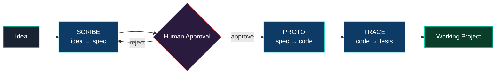

Each agent's output is verified by the next stage. This **verification chain** is central to the platform's design — Scribe specs are approved by humans, Proto code is tested by Trace, and Trace tests run automatically.

---

### Screenshots

<table>
  <tr>
    <td width="50%">
      <br/>
      <sub><b>Landing Page</b> — Hero with frosted-glass theme</sub>
    </td>
    <td width="50%">
      <br/>
      <sub><b>Chat Interface</b> — Sidebar, agent pipeline, message input</sub>
    </td>
  </tr>
  <tr>
    <td width="50%">
      <br/>
      <sub><b>Settings</b> — AI provider management and profile</sub>
    </td>
    <td width="50%">
      <br/>
      <sub><b>Documentation</b> — Getting started, AI setup, GitHub integration</sub>
    </td>
  </tr>
</table>

---

### Features

<table>
<tr>
<td width="50%" valign="top">

**Sequential Agent Pipeline**<br/>
<sub>Scribe (spec) → Human Gate → Proto (code) → Trace (tests)</sub>

</td>
<td width="50%" valign="top">

**Real-time Streaming**<br/>
<sub>SSE-powered live agent activity monitoring</sub>

</td>
</tr>
<tr>
<td width="50%" valign="top">

**GitHub via MCP**<br/>
<sub>Model Context Protocol: repos, branches, commits, PRs</sub>

</td>
<td width="50%" valign="top">

**Multi-provider AI**<br/>
<sub>Anthropic Claude, OpenAI, OpenRouter — user-configurable</sub>

</td>
</tr>
<tr>
<td width="50%" valign="top">

**OAuth Authentication**<br/>
<sub>GitHub + Google sign-in, email/password support</sub>

</td>
<td width="50%" valign="top">

**Pipeline Statistics**<br/>
<sub>Success rates, agent durations, execution history</sub>

</td>
</tr>
<tr>
<td width="50%" valign="top">

**Onboarding Flow**<br/>
<sub>Animated welcome wizard and profile setup</sub>

</td>
<td width="50%" valign="top">

**Full Localization**<br/>
<sub>Turkish and English UI support (i18n)</sub>

</td>
</tr>
</table>

---

### Architecture

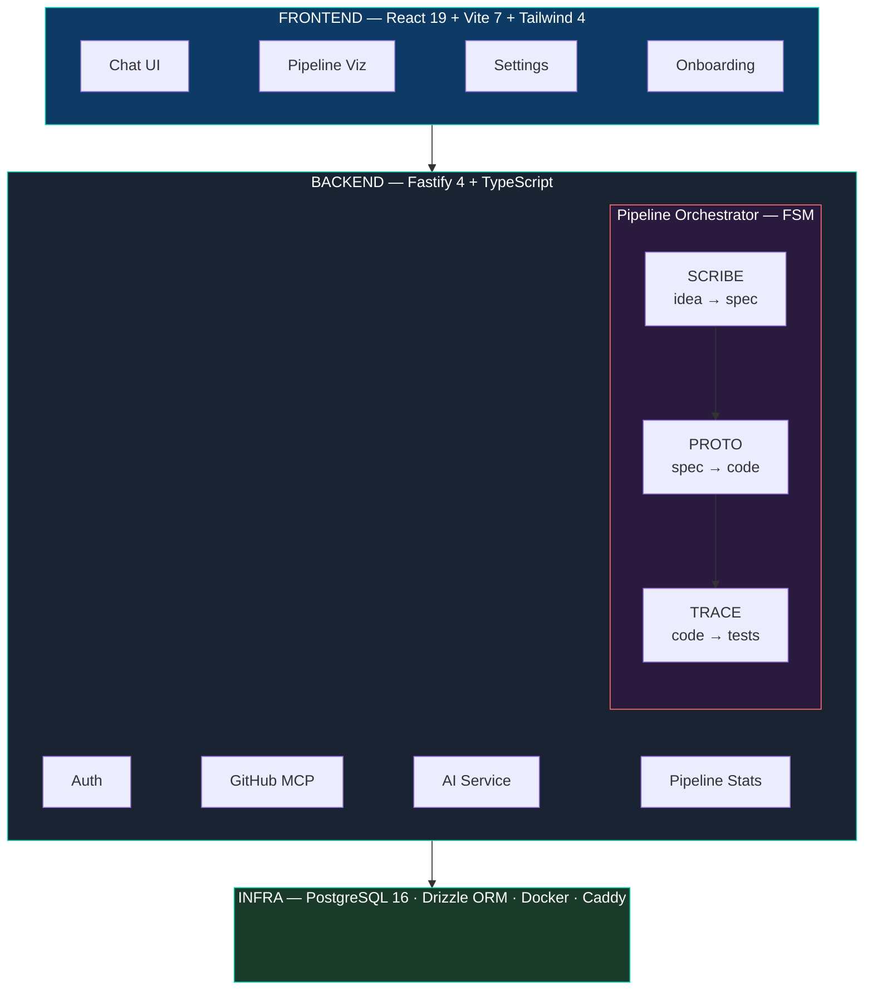

#### Agents

| Agent | Role | Input | Output |
|-------|------|-------|--------|
| **Scribe** | Business analyst — structures the idea | Free-text idea | Structured specification (markdown) |
| **Proto** | Builder — generates working code | Approved spec | MVP scaffold pushed to GitHub |
| **Trace** | Verifier — writes tests for the code | GitHub branch + code | Playwright test suite |

#### Verification Chain

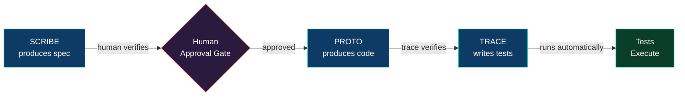

#### MCP Integration

AKIS uses the **Model Context Protocol (MCP)** to interface with GitHub. The pipeline's `GitHubMCPAdapter` wraps a `callToolRaw` bridge, allowing agents (Proto and Trace) to perform GitHub operations — creating repos, pushing branches, opening PRs — through a standardized tool-calling interface rather than direct API calls. A parallel `GitHubRESTAdapter` provides a fallback path when MCP is unavailable.

#### Pipeline State Machine

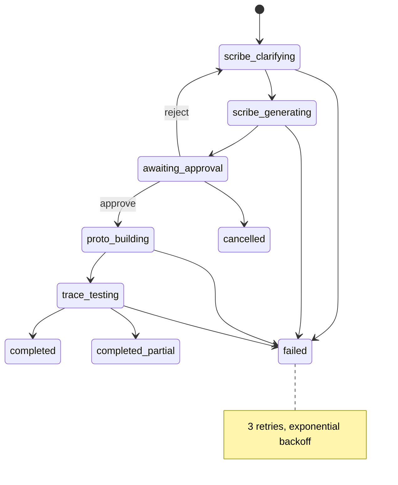

---

### Tech Stack

<p align="center">
  
  
  
  
</p>
<p align="center">
  
  
  
  
</p>
<p align="center">
  
  
  
  
</p>

---

### Project Structure

<details>
<summary><b>Show folder tree</b></summary>

```
devagents/
├── backend/                    Fastify 4 + TypeScript
│   └── src/
│       ├── pipeline/           Pipeline engine
│       │   ├── agents/         scribe/, proto/, trace/
│       │   ├── core/           PipelineOrchestrator, FSM, contracts
│       │   ├── adapters/       GitHubRESTAdapter, GitHubMCPAdapter
│       │   └── api/            pipeline.routes.ts
│       ├── api/                REST API routes (auth, github, settings)
│       ├── db/                 Drizzle ORM schema + migrations
│       └── services/           AI, auth, email services
├── frontend/                   React 19 + Vite 7 SPA
│   └── src/
│       ├── pages/              chat/, settings/, auth/, docs
│       ├── components/         chat/, onboarding/, ui/, pipeline/
│       ├── hooks/              usePipelineStream, useProfileCompleteness
│       └── services/api/       HTTP client, workflows, auth
├── deploy/                     Docker Compose, Caddy, deploy scripts
└── docs/                       Architecture & screenshots
```

</details>

---

### How to Use

Follow these steps to get started with AKIS. Live version: **[akisflow.com](https://akisflow.com)**

#### 1. Create an Account

- **Email/Password:** Go to the signup page (`/signup`) and enter your name, email, and password.
- **OAuth:** Click "Sign in with GitHub" or "Sign in with Google" for quick registration.
- After logging in, the welcome wizard will guide you through initial setup.

#### 2. Add an AI API Key

An AI provider API key is required for the pipeline to function.

1. Navigate to **Settings** (`/settings`).
2. Under the **AI Provider** tab, click "Add New Key".
3. Select your provider: **Anthropic** (recommended), **OpenAI**, or **OpenRouter**.
4. Paste your API key and save.

> [!IMPORTANT]
> The pipeline cannot start without an API key. Without a platform key, it falls back to mock mode. Keys are stored encrypted with AES-256-GCM.

#### 3. Connect GitHub

GitHub connection is required for Proto to push code and Trace to read it.

1. Go to **Settings > GitHub**.
2. Create a GitHub **Personal Access Token (PAT)** with `repo` and `workflow` scopes.
3. Paste the token and click "Connect".
4. Verify the connection — a green badge should show "Connected".

#### 4. Start a Pipeline

1. Navigate to the **Chat** page (`/chat`).
2. Type your idea in the message field, for example: *"A web app where users can share cooking recipes"*
3. Send it — the **Scribe** agent starts working.

#### 5. Interact with Scribe

Scribe analyzes your idea and may ask clarifying questions:
- You'll see questions in the chat interface.
- Type and send your answers — Scribe incorporates them into the spec.
- Once Scribe has enough information, it produces a structured specification document.

#### 6. Approve / Reject the Spec

When Scribe produces the spec:
- **Approve:** Review the spec for accuracy. If it looks good, click "Approve". Proto starts.
- **Reject:** If changes are needed, click "Reject" and provide feedback. Scribe will revise.

#### 7. Watch Proto Generate Code

After spec approval, Proto begins working:
- You'll see real-time progress in the chat (SSE stream).
- Proto generates an MVP scaffold based on the approved spec.
- On completion, code is pushed to GitHub (branch: `proto/scaffold-{timestamp}`).

#### 8. View Trace Test Results

After Proto finishes, Trace starts automatically:
- Trace reads the **actual code** from the GitHub branch Proto pushed.
- It writes Playwright automation tests specific to that code.
- The pipeline completes as `completed` or `completed_partial`.

> [!TIP]
> If an error occurs at any stage, use the "Retry" button to restart that stage (max 3 attempts).

---

### Development Setup

#### Prerequisites

- **Node.js** 20+ and **pnpm** 9+
- **Docker** (for PostgreSQL)
- API key from Anthropic, OpenAI, or OpenRouter

#### Setup

```bash
# Clone and enter
git clone https://github.com/OmerYasirOnal/akis-platform.git
cd akis-platform/devagents

# Start PostgreSQL
./scripts/db-up.sh

# Backend
cd backend
cp .env.example .env       # Configure your API keys
pnpm install
pnpm db:migrate
pnpm dev                   # http://localhost:3000

# Frontend (new terminal)
cd frontend
pnpm install
pnpm dev                   # http://localhost:5173
```

<details>
<summary><b>Key environment variables</b></summary>

| Variable | Purpose |
|----------|---------|
| `ANTHROPIC_API_KEY` | AI agent API calls |
| `DATABASE_URL` | PostgreSQL connection string |
| `AUTH_JWT_SECRET` | Session token signing (min 32 chars) |
| `GITHUB_OAUTH_CLIENT_ID` / `SECRET` | GitHub OAuth login |
| `GOOGLE_OAUTH_CLIENT_ID` / `SECRET` | Google OAuth login |

See [`backend/.env.example`](backend/.env.example) for the full configuration reference.

</details>

#### Quality Gate

Run before every commit:

```bash
# Backend
pnpm -C backend typecheck && pnpm -C backend lint && pnpm -C backend test:unit && pnpm -C backend build

# Frontend
pnpm -C frontend typecheck && pnpm -C frontend lint && pnpm -C frontend test && pnpm -C frontend build
```

---

### Contributing

See [`CONTRIBUTING.md`](CONTRIBUTING.md) for the full guide. Summary:

1. Fork the repo and clone it
2. Create a feature branch (`feat/short-description`)
3. Make your changes and pass the quality gate
4. Write a conventional commit message (`feat(scope): description`)
5. Open a pull request

---

### API Reference

<details>
<summary><b>Pipeline API</b></summary>

| Method | Endpoint | Description |
|--------|----------|-------------|
| `POST` | `/api/pipelines` | Start a new pipeline |
| `GET` | `/api/pipelines` | List pipeline history |
| `GET` | `/api/pipelines/:id` | Get pipeline status |
| `POST` | `/api/pipelines/:id/message` | Send message to Scribe |
| `POST` | `/api/pipelines/:id/approve` | Approve spec (triggers Proto) |
| `POST` | `/api/pipelines/:id/reject` | Reject spec (Scribe re-asks) |
| `POST` | `/api/pipelines/:id/retry` | Retry a failed stage |
| `DELETE` | `/api/pipelines/:id` | Cancel pipeline |

</details>

<details>
<summary><b>GitHub API</b></summary>

| Method | Endpoint | Description |
|--------|----------|-------------|
| `GET` | `/api/github/status` | Connection status |
| `GET` | `/api/github/repos` | List user repos |
| `POST` | `/api/github/repos` | Create a new repo |
| `POST` | `/api/github/connect` | Connect via PAT |

</details>

<details>
<summary><b>Auth API</b></summary>

| Method | Endpoint | Description |
|--------|----------|-------------|
| `POST` | `/auth/login/start` | Start login (email step) |
| `POST` | `/auth/login/complete` | Complete login (password step) |
| `GET` | `/auth/profile` | Current user profile |
| `PUT` | `/auth/profile` | Update profile |

</details>

---

### Security

<details>
<summary><b>Show security implementations</b></summary>

| Area | Implementation |
|------|---------------|
| **Authentication** | JWT sessions with httpOnly, secure, sameSite cookies |
| **Passwords** | bcrypt with 10 salt rounds |
| **API Key Storage** | AES-256-GCM with authenticated encryption (AEAD) |
| **Rate Limiting** | 120 req/min global via fastify-rate-limit |
| **CORS** | Strict origin whitelist |
| **Headers** | Helmet (CSP, HSTS, X-Frame-Options, X-Content-Type-Options) |
| **SQL** | Parameterized queries via Drizzle ORM |
| **Error Handling** | Sanitized responses, no stack traces in production |

</details>

---

### Deployment

AKIS is deployed on a single OCI ARM64 VM using Docker Compose with Caddy for automatic TLS.

**Production**: [https://akisflow.com](https://akisflow.com)

CI/CD runs on GitHub Actions — type-checking, linting, unit tests, and build verification on every push.

---

### Academic Context

AKIS is developed as a senior thesis project at **Fatih Sultan Mehmet Vakif University (FSMVU)**.

| | |
|---|---|
| **Student** | Omer Yasir Onal (2221221562) |
| **Advisor** | Dr. Nazli Dogan |
| **Thesis** | Knowledge Integrity & Agent Verification in AI-Assisted Software Development |
| **Deadline** | May 2026 |

The core thesis contribution is the **verification chain** — a multi-layered validation approach where each AI agent's output is verified by either a human reviewer or a downstream agent before progressing, ensuring knowledge integrity throughout the automated development pipeline.

---

### License

MIT — see [`LICENSE`](LICENSE) for details.

</details>
