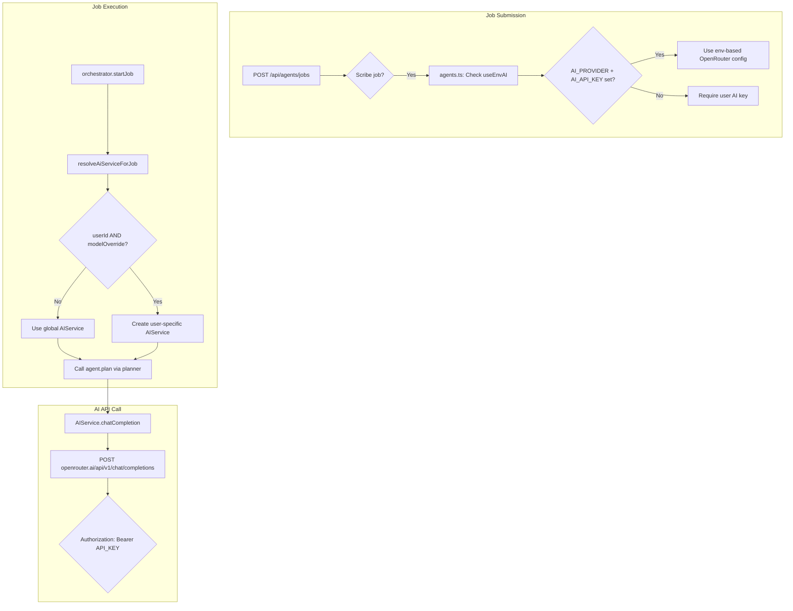

# DEBUG: Scribe AI 401 "No cookie auth credentials found" - Root Cause Analysis & Fix

**Status:** FIXED  
**Branch:** fix/scribe-demo-ux-mcp  
**Date:** 2026-01-07  
**Updated:** 2026-01-07 - Multi-provider support implemented

---

## Symptoms

**Error Message:**
```
AI API authentication failed (401)... No cookie auth credentials found
```

**When It Occurs:**
- After Scribe job submission
- During planning phase in `AgentOrchestrator.startJob()`
- When `AIService.chatCompletion()` makes a request to OpenRouter API

---

## What the System SHOULD Do



**Expected Auth Flow:**
1. `server.app.ts` creates global `AIService` (via `getAIConfig(env)`)
2. When Scribe job is submitted, `agents.ts` checks env-based AI config
3. `orchestrator.resolveAiServiceForJob()` returns global AIService (if no userId/modelOverride)
4. `AIService.chatCompletion()` sends `Authorization: Bearer <AI_API_KEY>` header to OpenRouter
5. OpenRouter returns 200 OK

---

## Trace to Source

### Call Chain:
```
POST /api/agents/jobs (agents.ts)
  -> orchestrator.submitJob()
  -> orchestrator.startJob()
    -> resolveAiServiceForJob() [Line 623-671]
      -> Returns global this.aiService (if !userId || !modelOverride)
    -> agent.plan(activeAiService.planner, context) [Line 329]
      -> AIService.planner.plan() [Line 202 AIService.ts]
        -> chatCompletion() [Line 288]
          -> fetch(openrouter.ai/api/v1/chat/completions) [Line 335]
            -> 401 Response with "No cookie auth credentials found"
```

### Critical Files:
- `backend/src/server.app.ts`: Line 1 had `import 'dotenv/config'` - CWD-dependent env loading (REMOVED)
- `backend/src/config/env.ts`: Line 16-19 - `backend/.env` and `backend/.env.local` loading
- `backend/src/services/ai/AIService.ts`: Line 294-299 - API key check, Line 379-396 - 401 error handling
- `backend/src/core/orchestrator/AgentOrchestrator.ts`: Line 642-649 - Global AIService fallback logic

---

## Environment/Config Findings

### Env Files:
| File | AI_PROVIDER | AI_API_KEY | AI_BASE_URL |
|------|-------------|------------|-------------|
| `backend/.env` | `openrouter` | `sk-or-v1-...` (set) | `https://openrouter.ai/api/v1` |
| `backend/.env.local` | (same as .env) | (same) | (same) |
| Root `.env` | N/A | N/A | N/A |

### Env Loading Order (Conflict Source):
1. `server.app.ts` Line 1: `import 'dotenv/config'` - Loads `.env` from CWD
2. `env.ts` Line 16: `loadEnv({ path: 'backend/.env' })` - Loads backend/.env
3. `env.ts` Line 19: `loadEnv({ path: 'backend/.env.local', override: true })` - Override

**Problem:** If backend CWD = repo root, `dotenv/config` loads root `.env`. Then `env.ts` loads `backend/.env` but values already set by `dotenv/config` are NOT overridden (process.env values are preserved).

### getAIConfig() Behavior (env.ts Line 272-327):
```typescript
// provider = env.AI_PROVIDER (default: 'mock')
// openrouter: apiKey = env.AI_API_KEY || env.OPENROUTER_API_KEY
// baseUrl = env.AI_BASE_URL || 'https://openrouter.ai/api/v1'
```

---

## Root Cause

### Primary Cause: Env Loading Race Condition

The `import 'dotenv/config'` statement in `server.app.ts` loads the wrong `.env` file based on CWD, conflicting with `env.ts` loading logic.

**Scenarios:**
1. Backend runs from `dist/` - `import.meta.dirname` resolves differently
2. Root `.env` vs `backend/.env` value differences (root has no AI_API_KEY)
3. `dotenv/config` runs first, sets empty/wrong values that `env.ts` cannot override

### Secondary Cause: resolveAiServiceForJob Fallback

`AgentOrchestrator.resolveAiServiceForJob()` (Line 642-649):
```typescript
if (jobType !== 'scribe') {
  return { aiService: this.aiService, metrics }; // Global
}
const userId = payload.userId as string | undefined;
const modelOverride = payload.llmModelOverride as string | undefined;
if (!userId || !modelOverride) {
  return { aiService: this.aiService, metrics }; // Global fallback
}
```

If `userId` or `llmModelOverride` is missing from payload, global `this.aiService` is used. If global AIService was created with wrong config, 401 occurs.

### Why "No cookie auth credentials found"?

This message comes from OpenRouter API. OpenRouter returns this when it receives an invalid/empty Bearer token (cookie auth is an alternative auth method for OpenRouter).

---

## Fix Applied

### Option A: Remove dotenv/config Import (IMPLEMENTED)

**Changes Made:**
1. Removed `import 'dotenv/config'` from `server.app.ts` Line 1
2. Added comment explaining why this import should not be used
3. `env.ts` already handles env loading with correct precedence

**Files Changed:**
- `backend/src/server.app.ts` (Line 1)

**Rationale:**
- `env.ts` already implements correct loading: Shell exports > .env.local > .env
- `dotenv/config` was redundant and caused race condition
- Single source of truth for env loading

### Diagnostic Logging Added

**Changes Made:**
1. Extended `AIService.getConfigSummary()` to include `baseUrl`, `hasApiKey`, `apiKeyPrefix`
2. Added diagnostic logs in `server.app.ts` for AI config verification

**Files Changed:**
- `backend/src/services/ai/AIService.ts` (interface + implementations)
- `backend/src/server.app.ts` (additional console.log statements)

**Startup Log Output:**
```
[buildApp] AI Provider: openrouter
[buildApp] AI Models: default=..., planner=..., validation=...
[buildApp] AI Base URL: https://openrouter.ai/api/v1
[buildApp] AI API Key: configured
[buildApp] AI API Key prefix: sk-or-v1-6...
```

---

## Validation Checklist

### Repro Steps:
1. Start backend: `cd backend && pnpm dev`
2. Login in frontend and create Scribe config
3. Submit Scribe job (mode: from_config or test)
4. Check job status: `GET /api/agents/jobs/:id`

### Logs to Check:
```bash
# AIService config summary at startup
grep "AI Provider" backend.log

# Job execution logs
grep "resolveAiServiceForJob" backend.log

# AI call errors
grep "AI_AUTH_ERROR\|401\|authentication failed" backend.log
```

### Success Criteria:
- [x] Build passes: `pnpm build`
- [x] All tests pass: `pnpm test` (169 tests, 0 failures)
- [x] AI config correctly loaded at startup (verified via logs)
- [ ] Job state: `completed` (not `failed`) - Manual test required
- [ ] Job plans table has plan record - Manual test required
- [ ] Job audits table has `plan` phase audit - Manual test required
- [ ] AI call metrics show `success: true` - Manual test required
- [ ] No 401 errors - Manual test required

---

## Risks and Tradeoffs

### Low Risk:
- `env.ts` already handles all env loading properly
- No changes to authentication or authorization logic
- No changes to AIService business logic

### Testing Required:
- CI/CD environment env loading behavior should be verified
- Docker-based deployments should be tested

---

## Architecture Compliance

- [x] No redesign of Auth flows
- [x] Orchestrator injects tools; agents do not create clients
- [x] Server-side job execution does not depend on browser cookies
- [x] External integrations remain MCP-only
- [x] No secrets logged or committed

---

## Update: Multi-Provider AI Support (2026-01-07)

### Real Root Cause Identified

The original diagnosis was partially correct about env loading, but the **actual root cause** was in `resolveAiServiceForJob()`:

1. `agents.ts` correctly detected `useEnvAI=true` when env had OpenRouter configured
2. BUT `agents.ts` still added `llmModelOverride` to payload
3. `orchestrator.resolveAiServiceForJob()` checked `userId && modelOverride` condition
4. When true, it HARDCODED `provider: 'openai'` regardless of env config
5. This created AIService with `openai` provider using user's (missing) OpenAI key
6. OpenRouter API received request with wrong/missing key -> 401 "No cookie auth credentials found"

### Multi-Provider Solution Implemented

**Backend Changes:**
1. Extended `AIKeyProvider` type to `'openai' | 'openrouter'`
2. Added `activeAiProvider` column to users table via migration
3. New API endpoints:
   - `GET /api/settings/ai-keys/status` - Returns both providers' status + active provider
   - `PUT /api/settings/ai-provider/active` - Set active provider
4. Updated `resolveAiServiceForJob()`:
   - Checks `useEnvAI` flag first
   - Uses user's active provider from DB
   - Falls back to env only when appropriate
   - Never hardcodes provider

**Frontend Changes:**
1. Updated Settings > API Keys page with provider selector
2. Can save keys for both OpenAI and OpenRouter
3. Can set active provider
4. Shows both providers' configuration status

### Verification

```bash
# Backend startup should show:
[buildApp] AI Provider: openrouter
[buildApp] AI API Key: configured

# Job execution should show:
[resolveAiServiceForJob] Using global AIService (useEnvAI=true)
# OR
[resolveAiServiceForJob] Creating user AIService: provider=openrouter, hasApiKey=true
```

### Files Changed

- `backend/src/services/ai/user-ai-keys.ts` - Multi-provider types + functions
- `backend/src/api/settings/ai-keys.ts` - Multi-provider API endpoints
- `backend/src/core/orchestrator/AgentOrchestrator.ts` - Fixed `resolveAiServiceForJob`
- `backend/src/api/agents.ts` - Added `useEnvAI` to payload
- `backend/src/db/schema.ts` - Added `activeAiProvider` column
- `backend/migrations/0017_add_active_ai_provider.sql` - Migration
- `frontend/src/services/api/ai-keys.ts` - Multi-provider API client
- `frontend/src/pages/dashboard/settings/DashboardSettingsApiKeysPage.tsx` - Provider UI
