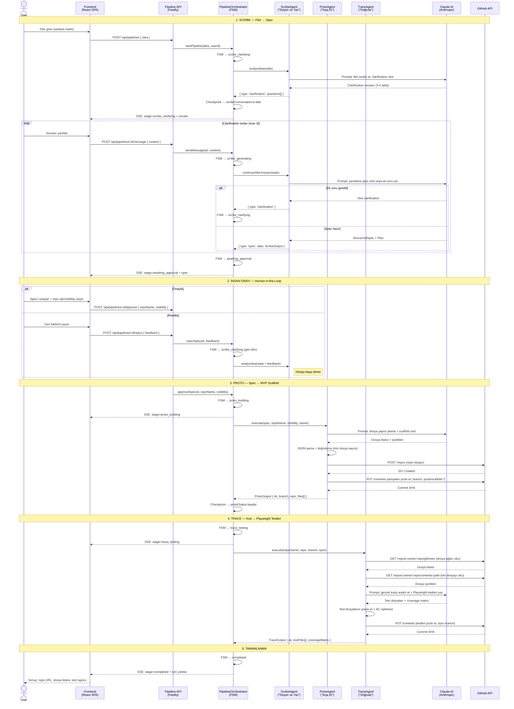
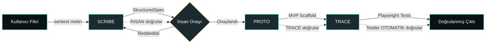
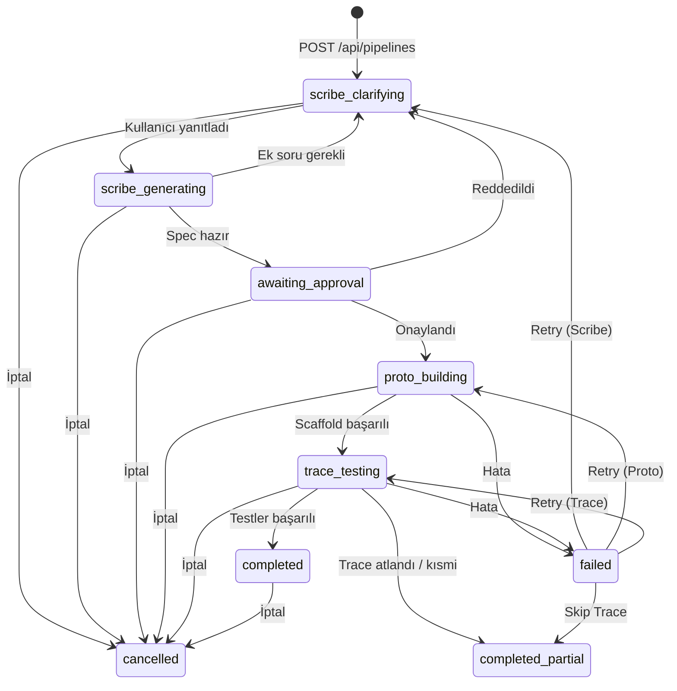

# AKIS Pipeline — Sequence Diagram

## Agent Communication Flow (Scribe → Proto → Trace)

```mermaid
sequenceDiagram
    actor User
    participant FE as Frontend<br/>(React SPA)
    participant API as Pipeline API<br/>(Fastify)
    participant Orch as PipelineOrchestrator<br/>(FSM)
    participant Scribe as ScribeAgent<br/>("Düşün ve Yaz")
    participant Proto as ProtoAgent<br/>("İnşa Et")
    participant Trace as TraceAgent<br/>("Doğrula")
    participant AI as Claude AI<br/>(Anthropic)
    participant GH as GitHub API

    Note over User,GH: 1. SCRIBE — Fikir → Spec

    User->>FE: Fikir girer (serbest metin)
    FE->>API: POST /api/pipelines { idea }
    API->>Orch: startPipeline(idea, userId)
    Orch->>Orch: FSM → scribe_clarifying
    Orch->>Scribe: analyzIdea(state)
    Scribe->>AI: Prompt: fikri analiz et, clarification üret
    AI-->>Scribe: Clarification soruları (3-5 adet)
    Scribe-->>Orch: { type: 'clarification', questions[] }
    Orch->>Orch: Checkpoint → scribeConversation'a ekle
    Orch-->>FE: SSE: stage=scribe_clarifying + sorular

    loop Clarification turları (max 3)
        User->>FE: Soruları yanıtlar
        FE->>API: POST /api/pipelines/:id/message { content }
        API->>Orch: sendMessage(id, content)
        Orch->>Orch: FSM → scribe_generating
        Orch->>Scribe: continueAfterAnswer(state)
        Scribe->>AI: Prompt: yanıtlarla spec üret veya ek soru sor
        alt Ek soru gerekli
            AI-->>Scribe: Yeni clarification
            Scribe-->>Orch: { type: 'clarification' }
            Orch->>Orch: FSM → scribe_clarifying
        else Spec hazır
            AI-->>Scribe: StructuredSpec + Plan
            Scribe-->>Orch: { type: 'spec', data: ScribeOutput }
        end
    end

    Orch->>Orch: FSM → awaiting_approval
    Orch-->>FE: SSE: stage=awaiting_approval + spec

    Note over User,GH: 2. İNSAN ONAYI — Human-in-the-Loop

    alt Onayla
        User->>FE: Spec'i onaylar + repo adı/visibility seçer
        FE->>API: POST /api/pipelines/:id/approve { repoName, visibility }
    else Reddet
        User->>FE: Geri bildirim yazar
        FE->>API: POST /api/pipelines/:id/reject { feedback }
        API->>Orch: rejectSpec(id, feedback)
        Orch->>Orch: FSM → scribe_clarifying (geri dön)
        Orch->>Scribe: analyzIdea(state + feedback)
        Note right of Scribe: Döngü başa döner
    end

    Note over User,GH: 3. PROTO — Spec → MVP Scaffold

    API->>Orch: approveSpec(id, repoName, visibility)
    Orch->>Orch: FSM → proto_building
    Orch-->>FE: SSE: stage=proto_building
    Orch->>Proto: execute(spec, repoName, visibility, owner)
    Proto->>AI: Prompt: dosya yapısı planla + scaffold üret
    AI-->>Proto: Dosya listesi + içerikleri
    Proto->>Proto: JSON parse + doğrulama (min dosya sayısı)
    Proto->>GH: POST /repos (repo oluştur)
    GH-->>Proto: 201 Created
    Proto->>GH: PUT /contents (dosyaları push et, branch: proto/scaffold-*)
    GH-->>Proto: Commit SHA
    Proto-->>Orch: ProtoOutput { ok, branch, repo, files[] }
    Orch->>Orch: Checkpoint → protoOutput kaydet

    Note over User,GH: 4. TRACE — Kod → Playwright Testleri

    Orch->>Orch: FSM → trace_testing
    Orch-->>FE: SSE: stage=trace_testing
    Orch->>Trace: execute(repoOwner, repo, branch, spec)
    Trace->>GH: GET /repos/:owner/:repo/git/trees (dosya ağacı oku)
    GH-->>Trace: Dosya listesi
    Trace->>GH: GET /repos/:owner/:repo/contents/:path (her dosyayı oku)
    GH-->>Trace: Dosya içerikleri
    Trace->>AI: Prompt: gerçek kodu analiz et + Playwright testleri yaz
    AI-->>Trace: Test dosyaları + coverage matrix
    Trace->>Trace: Test dosyalarını parse et + AC eşlemesi
    Trace->>GH: PUT /contents (testleri push et, aynı branch)
    GH-->>Trace: Commit SHA
    Trace-->>Orch: TraceOutput { ok, testFiles[], coverageMatrix }

    Note over User,GH: 5. TAMAMLANMA

    Orch->>Orch: FSM → completed
    Orch-->>FE: SSE: stage=completed + tüm çıktılar
    FE-->>User: Sonuç: repo URL, dosya listesi, test raporu
```

## Doğrulama Zinciri (Knowledge Integrity)

```mermaid
flowchart LR
    A[Kullanıcı Fikri] -->|serbest metin| B[SCRIBE]
    B -->|StructuredSpec| C{İnsan Onayı}
    C -->|Onaylandı| D[PROTO]
    C -->|Reddedildi| B
    D -->|MVP Scaffold| E[TRACE]
    E -->|Playwright Tests| F[Doğrulanmış Çıktı]

    style A fill:#0A1215,stroke:#07D1AF,color:#fff
    style B fill:#1a2a30,stroke:#07D1AF,color:#fff
    style C fill:#1a2a30,stroke:#FFD700,color:#fff
    style D fill:#1a2a30,stroke:#07D1AF,color:#fff
    style E fill:#1a2a30,stroke:#07D1AF,color:#fff
    style F fill:#0A1215,stroke:#07D1AF,color:#fff

    B -.->|"İNSAN doğrular"| C
    D -.->|"TRACE doğrular"| E
    E -.->|"Testler OTOMATİK doğrular"| F
```

## FSM State Transitions

```mermaid
stateDiagram-v2
    [*] --> scribe_clarifying: POST /api/pipelines

    scribe_clarifying --> scribe_generating: Kullanıcı yanıtladı
    scribe_generating --> scribe_clarifying: Ek soru gerekli
    scribe_generating --> awaiting_approval: Spec hazır

    awaiting_approval --> proto_building: Onaylandı
    awaiting_approval --> scribe_clarifying: Reddedildi

    proto_building --> trace_testing: Scaffold başarılı
    proto_building --> failed: Hata

    trace_testing --> completed: Testler başarılı
    trace_testing --> completed_partial: Trace atlandı / kısmi
    trace_testing --> failed: Hata

    failed --> scribe_clarifying: Retry (Scribe)
    failed --> proto_building: Retry (Proto)
    failed --> trace_testing: Retry (Trace)
    failed --> completed_partial: Skip Trace

    scribe_clarifying --> cancelled: İptal
    scribe_generating --> cancelled: İptal
    awaiting_approval --> cancelled: İptal
    proto_building --> cancelled: İptal
    trace_testing --> cancelled: İptal
    completed --> cancelled: İptal
```
