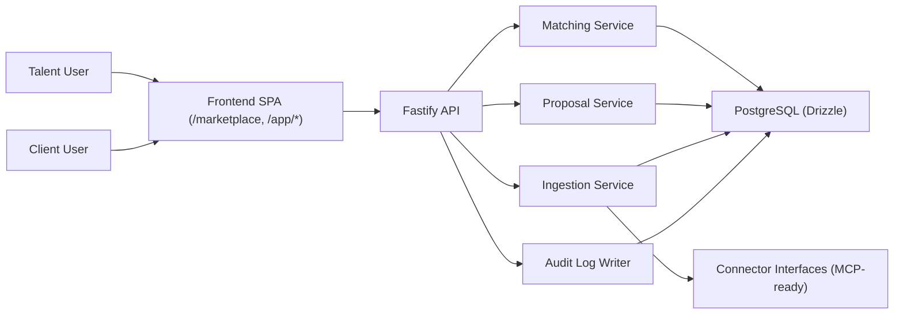

# AKIS Workstream Architecture

## 1. System Overview
AKIS Workstream extends existing AKIS stack:
- Backend: Fastify + Drizzle + PostgreSQL
- Frontend: React + Vite + Tailwind SPA
- Auth: Existing JWT session cookie model
- Integrations: Connector interfaces, manual ingest in MVP

## 2. Component Diagram

## 3. Data Model Overview
Core entities:
- `users` (existing)
- `profiles`
- `skills`
- `portfolios`
- `job_sources`
- `job_posts`
- `matches`
- `proposals`
- `audit_log`

## 4. AI Pipeline (MVP and Evolution)
### MVP
1. Requirement extraction (rule/keyword-based parsing from job post).
2. Deterministic feature scoring.
3. Explanation JSON generation.
4. Proposal template rendering.

### v1 Direction
1. Retrieval (embedding index).
2. Rerank (feature-rich model).
3. Calibrated confidence.
4. Human-readable explanation with fairness metadata.

## 5. Integration Strategy
- MVP: manual ingest endpoint + connector payload schema.
- Later: scheduled ingestion workers per source.
- Rate limits: per-source throttling and backoff policy.
- Compliance: each connector must include terms/policy metadata before activation.

## 6. Reliability and Safety
- Zod validation on API boundaries.
- Centralized error envelope alignment with AKIS backend.
- Audit events for profile update, ingest, match run, proposal generate.
- Feature flag for optional LLM proposal generation.

## 7. Assumptions / TODO
- TODO: exact connector auth specs will be finalized once official API contracts are confirmed.
- TODO: payment architecture is postponed to Phase 1.
